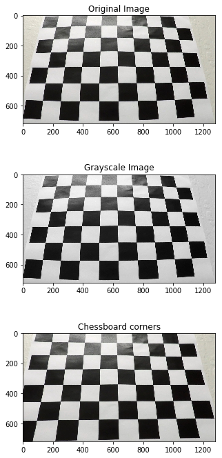
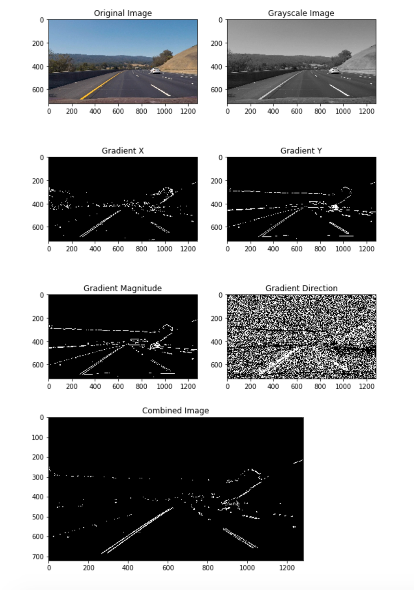
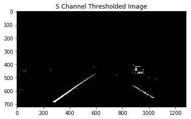
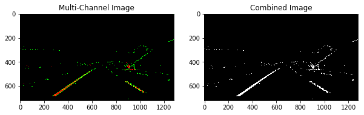
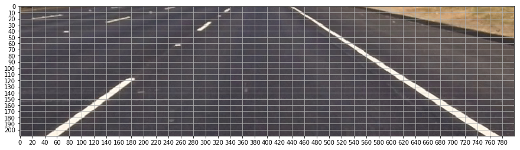
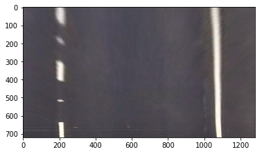
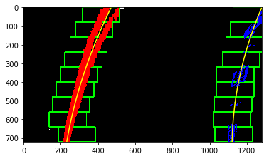
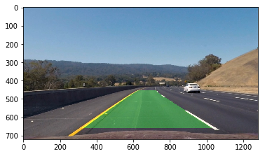

# Advanced Lane Finding Project

This project demonstrates using advanced computer vision techniques to detect the road lanes. Project-1 was a demonstration of using line detection algorithm - Hough transform - technique, whereas this project goes beyond addressing road lanes as straight line and fits a second order polinomial to represent them better.

First section of the project estimates the camera calibration matrix using some chess board images provided. These parameters are used to rectify the images and remove camera distortions. In next steps, we use some advanced thresholding techniques to seperate the lane lines and fit a higher order polynomial to estimate the lane lines. Later, this algorithm is applied to lane lines (with some modifications!) to estimate lane lines in the video. 

__File Description__
- _submission/project_report.md_: Project report
- _submission/Advanced_Lane_Finding.html_: HTML version of `coding/Advanced_Lane_Finding.ipynb`, where I ran different trials on threshold values and testing algorithms on images.
- _submission/Advanced_Lane_Submission.html_: HTML version of `coding/Advanced_Lane_Submission.ipynb` which shows the final results on video.

### Camera Calibration

Lecture/Quiz questions showed how to estimate camera matrix/parameters form one image. I used the similar technique on multiple images. Using multiple images helps us estimate the camera parameters better. 

I read all the camera image file names into `calibration_images` and loop through each image. For each image, I convert it to gray scale image and find chess board pattern in the image. 
```
nx=9
ny=6
for calibration_image in calibration_images:
    img_color=cv2.imread(calibration_image)
    img_gray=cv2.cvtColor(img_color,cv2.COLOR_BGR2GRAY)
    ret,corners=cv2.findChessboardCorners(img_gray,(nx,ny),None)
    if ret == True:
        objectpoints.append(objp)
        corners2=cv2.cornerSubPix(img_gray,corners,(11,11),(-1,-1),criteria)
        imagepoints.append(corners2)        
```

I create a meshgrid of corners in chessboard, assuming they are at same `z` distance, called `objp`. These points, along with detected corners are used to find camera matrix: 

```
ret, mtx, dist, rvecs, tvecs = cv2.calibrateCamera(objectpoints, imagepoints, _img_gray.shape[::-1],None,None)
```

I referred to [opencv calibration example](http://docs.opencv.org/3.1.0/dc/dbb/tutorial_py_calibration.html) and used `cv2.cornerSubPix` method to refine corner edges. [`(11,11)` tuple argument in `cornerSubPix` function is a corner search window, and not to be confused with number of corners]


### Pipeline (single images)

#### 1. Provide an example of a distortion-corrected image.

Below image shows an example of camera calibration and undistorting images. First image is a undistortion of one of calibraion images:



Undistortion of road image:


#### 2. Thresholding

I use color and gradient thresholding to get the lane lines from the road images. `abs_sobel_thresh`, `dir_threshold` and `mag_threshold` functions are used to apply sobel filter of `kernel=(ksize,ksize)`. Outputs from these are combined into one image as shown below:



Similarly, I use S channel from HLS color space to get the binary image as shown belo:



Following parameters gave me good results:

- ksize=11
- gradx_thresh=(30, 110)
- grady_thresh=(50, 250)
- mag_thresh=(50, 150)
- dir_thresh=(0.5, 1.2)
- hls_thresh=(170,255)

Finally, `combine_bin_images` combines gradient thresholded image and s channel thresholded image into a new binary image showing the lane pixels in white:




#### 3. Perspective Transform

I find the transformation in `Advanced_Lane_Finding.ipynb` and pickle it for future use in `Advanced_Lane_Submission.ipynb`. I manually find the image points by closely looking into the image with straight lane lines. To help my process, I crop the image into lane lines and draw a grid on it, as shown below.



I got following point mapping:

| Source        | Destination   | 
|:-------------:|:-------------:| 
| (580,460)  | (200,100) |
| (290,660)  | (200,720) |
| (710,460)  | (1100,100) |
| (1030,660) | (1100,720) |

This is the result of my transformation: 




#### 4. Detecting Lane Pixels

I use perspective transformed and threshold applied image to detect lane pixels. Initially, I run a histogram method to get a initial estimate of x-values and then use sliding window to get all the non zero pixels. Later, I fit a 2nd degree polynomial to the non-zero pixels and derive the lane equations.

Below image shows the result of my method:



#### 5. Radius of Curvature and Vehicle Position.

I followed the instructions in lecture notes to get the lane radius of curvature. I calculate it in `In [12]` in `coding/Advanced_Lane_Submission.ipynb` file.  Using the previously fitted line and assumption that camera is mounted at the center of the vehicle, I find the difference in distance to left and right lines from center of the image. This gives an estimate of vehicle offset.

#### 6. Final Result.

Once I have the estimate of lines, I use `reproject_lines` function to reproject the estimated lines on the original image using `Minv` perspective transformation. Below image shows the result:




---

### Pipeline (video)

#### 1.Final Video

I used the techniques mentioned above with a small modification to work on the video. I used a class called `Line` to store the important attributes of the left and right lanes. I also used a fixed length queue `deque(maxlen=10)` to store previously fitted x-values. This helped me in smooth out the lane projections and effectively find window to search lane pixels in consecutive frames.

Here is a [YouTube link](https://www.youtube.com/watch?v=D2p78_DVhto) to my video:

[](https://www.youtube.com/watch?v=D2p78_DVhto)


---

### Discussion

Steps to improve the algorithm:

1. Current approach depends solely on the threshold values. These are not adaptive and hard coded to this case. I should find a better way to generalize the thresholds or find an adaptive way to determine it.
2. Fitting a polynomial line to all non zero pixel values might not be a good idea. I observed in the `harder_challenge_video.mp4` video that, there was too much noise in the some regions.
3. Higher order line equation can be fit for some steep turns.


