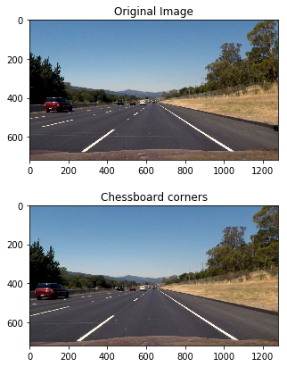

# Advanced Lane Finding Project

This project demonstrates using advanced computer vision techniques to detect the road lanes. Project-1 was a demonstration of using line detection algorithm - Hough transform - technique, whereas this project goes beyond addressing road lanes as straight line and fits a second order polinomial to represent them better.

First section of the project estimates the camera calibration matrix using some chess board images provided. These parameters are used to rectify the images and remove camera distortions. In next steps, we use some advanced thresholding techniques to seperate the lane lines and fit a higher order polynomial to estimate the lane lines. Later, this algorithm is applied to lane lines (with some modifications!) to estimate lane lines in the video. 

### Camera Calibration

Lecture/Quiz questions showed how to estimate camera matrix/parameters form one image. I used the similar technique on multiple images. Using multiple images helps us estimate the camera parameters better. 

I read all the camera image file names into `calibration_images` and loop through each image. For each image, I convert it to gray scale image and find chess board pattern in the image. 
```
nx=9
ny=6
for calibration_image in calibration_images:
    img_color=cv2.imread(calibration_image)
    img_gray=cv2.cvtColor(img_color,cv2.COLOR_BGR2GRAY)
    ret,corners=cv2.findChessboardCorners(img_gray,(nx,ny),None)
    if ret == True:
        objectpoints.append(objp)
        corners2=cv2.cornerSubPix(img_gray,corners,(11,11),(-1,-1),criteria)
        imagepoints.append(corners2)        
```

I create a meshgrid of corners in chessboard, assuming they are at same `z` distance, called `objp`. These points, along with detected corners are used to find camera matrix: 

```
ret, mtx, dist, rvecs, tvecs = cv2.calibrateCamera(objectpoints, imagepoints, _img_gray.shape[::-1],None,None)
In [12]:

```

I referred to [opencv calibration example](http://docs.opencv.org/3.1.0/dc/dbb/tutorial_py_calibration.html) and used `cv2.cornerSubPix` method to refine corner edges. [`(11,11)` tuple argument in `cornerSubPix` function is a corner search window, and not to be confused with number of corners]


### Pipeline (single images)

#### 1. Provide an example of a distortion-corrected image.

Below image shows an example of camera calibration and undistorting images. First image is a undistortion of one of calibraion images and second one shows a road image.





#### 2. Thresholding

I use color and gradient thresholding to get the lane lines from the road images. `abs_sobel_thresh`, `dir_threshold` and `mag_threshold` functions are used to apply sobel filter of `kernel=(ksize,ksize)`. Outputs from these are combined into one image as shown below:


Similarly, I use S channel from HLS color space to get the binary image as shown belo:


Following parameters gave me good results:

- ksize=11
- gradx_thresh=(30, 110)
- grady_thresh=(50, 250)
- mag_thresh=(50, 150)
- dir_thresh=(0.5, 1.2)
- hls_thresh=(170,255)

Finally, `combine_bin_images` combines gradient thresholded image and s channel thresholded image into a new binary image showing the lane pixels in white:


####3. Describe how (and identify where in your code) you performed a perspective transform and provide an example of a transformed image.

The code for my perspective transform includes a function called `warper()`, which appears in lines 1 through 8 in the file `example.py` (output_images/examples/example.py) (or, for example, in the 3rd code cell of the IPython notebook).  The `warper()` function takes as inputs an image (`img`), as well as source (`src`) and destination (`dst`) points.  I chose the hardcode the source and destination points in the following manner:

```
src = np.float32(
    [[(img_size[0] / 2) - 55, img_size[1] / 2 + 100],
    [((img_size[0] / 6) - 10), img_size[1]],
    [(img_size[0] * 5 / 6) + 60, img_size[1]],
    [(img_size[0] / 2 + 55), img_size[1] / 2 + 100]])
dst = np.float32(
    [[(img_size[0] / 4), 0],
    [(img_size[0] / 4), img_size[1]],
    [(img_size[0] * 3 / 4), img_size[1]],
    [(img_size[0] * 3 / 4), 0]])

```
This resulted in the following source and destination points:

| Source        | Destination   | 
|:-------------:|:-------------:| 
| 585, 460      | 320, 0        | 
| 203, 720      | 320, 720      |
| 1127, 720     | 960, 720      |
| 695, 460      | 960, 0        |

I verified that my perspective transform was working as expected by drawing the `src` and `dst` points onto a test image and its warped counterpart to verify that the lines appear parallel in the warped image.

![alt text][image4]

####4. Describe how (and identify where in your code) you identified lane-line pixels and fit their positions with a polynomial?

Then I did some other stuff and fit my lane lines with a 2nd order polynomial kinda like this:

![alt text][image5]

####5. Describe how (and identify where in your code) you calculated the radius of curvature of the lane and the position of the vehicle with respect to center.

I did this in lines # through # in my code in `my_other_file.py`

####6. Provide an example image of your result plotted back down onto the road such that the lane area is identified clearly.

I implemented this step in lines # through # in my code in `yet_another_file.py` in the function `map_lane()`.  Here is an example of my result on a test image:

![alt text][image6]

---

###Pipeline (video)

####1. Provide a link to your final video output.  Your pipeline should perform reasonably well on the entire project video (wobbly lines are ok but no catastrophic failures that would cause the car to drive off the road!).

Here's a [link to my video result](./project_video.mp4)

---

###Discussion

####1. Briefly discuss any problems / issues you faced in your implementation of this project.  Where will your pipeline likely fail?  What could you do to make it more robust?

Here I'll talk about the approach I took, what techniques I used, what worked and why, where the pipeline might fail and how I might improve it if I were going to pursue this project further.  

[//]: # (Image References)

[image1]: ./examples/undistort_output.png "Undistorted"
[image2]: ./test_images/test1.jpg "Road Transformed"
[image3]: ./examples/binary_combo_example.jpg "Binary Example"
[image4]: ./examples/warped_straight_lines.jpg "Warp Example"
[image5]: ./examples/color_fit_lines.jpg "Fit Visual"
[image6]: ./examples/example_output.jpg "Output"
[video1]: ./project_video.mp4 "Video"
